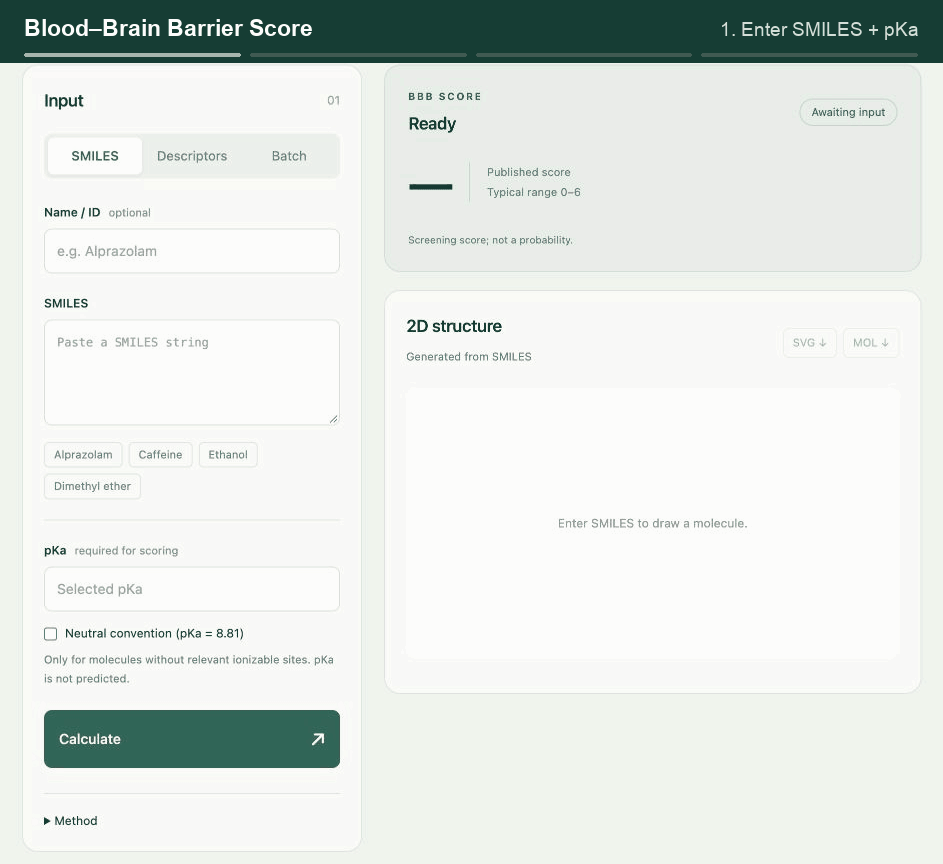

# BBB Score

A Python/RDKit app for the [Gupta et al. (2019) BBB Score](https://doi.org/10.1021/acs.jmedchem.9b01220).



- Compute descriptors and 2D structures from SMILES.
- Score SMILES + pKa or supplied descriptors; inspect each contribution.
- Import CSV/XLSX and flag invalid or missing inputs.
- Export results as CSV and structures as SVG/MOL.

## Run

Python 3.10+:

```sh
python3 -m venv .venv
.venv/bin/python -m pip install -r requirements.txt
.venv/bin/python app.py
```

Open <http://127.0.0.1:8000>. On Windows, use `.venv\Scripts\python`.

## Method

```text
MWHBN = (HBA + HBD) / sqrt(MW)
BBB Score = P(AroR) + P(HA) + 1.5 P(MWHBN) + 2 P(TPSA) + 0.5 P(pKa)
```

Piecewise functions follow the [author's calculator](https://acs.figshare.com/articles/dataset/10046255). pKa is supplied, not predicted; the neutral convention (8.81) requires confirmation. RDKit descriptors may differ from the original toolkits. The score is a screening heuristic, not a probability. SMILES is required for 2D depiction unless a verified local structure is available.

## Tests

```sh
.venv/bin/python -m unittest discover -s tests -v
```

22 tests cover the public reference value, scoring boundaries, structure validation, stereochemistry, file parsing, and exports.

Local processing with no external requests. Demo inputs are public or synthetic; private datasets are excluded.
